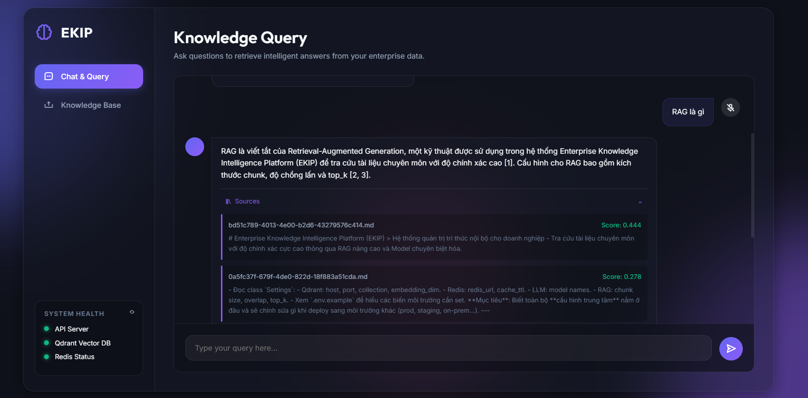
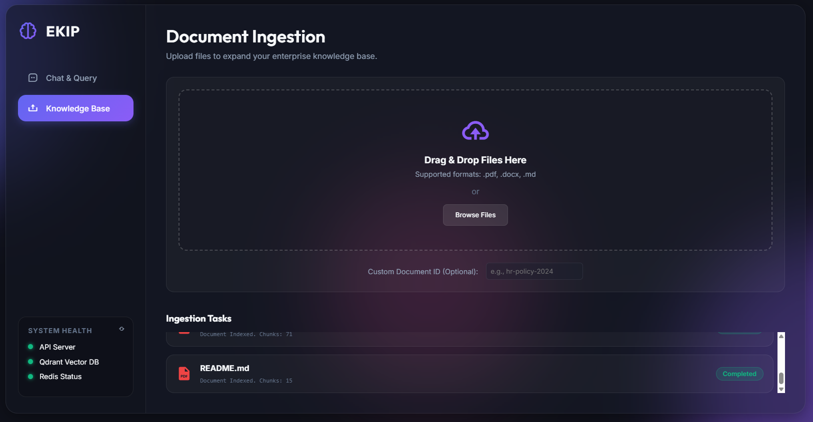

# myEKIP - Enterprise Knowledge Intelligence Platform

myEKIP is a cutting-edge Enterprise Knowledge Intelligence Platform that leverages advanced RAG (Retrieval-Augmented Generation) technology to ingest, index, and intelligently query your enterprise documents. It provides a high-performance FastAPI backend and a scalable background processing architecture.

---


---
## 🌟 Key Features

- **Intelligent RAG Querying**: Powered by Google GenAI (Gemini) and vector search to provide precise, context-aware answers from your uploaded documents.
- **Asynchronous Document Ingestion**: Supports `.pdf`, `.docx`, and `.md` formats using IBM Docling for robust parsing. Ingestion is handled asynchronously via **Celery** to ensure the API remains lightning-fast.
- **Advanced Vector Storage**: Utilizes **Qdrant** for high-dimensional vector similarity search.
- **Smart Caching Engine**: Integrates **Redis** to cache frequent queries, reducing LLM costs and improving response times dramatically.
- **Docker-Ready Architecture**: Fully containerized with Docker Compose for seamless deployment and orchestration.

---

## 🏛 Architecture Overview

The system is built on a modern, decoupled microservices architecture:

1. **Backend API (`app/api`)**: A **FastAPI** application (`ekip_api`) exposing endpoints for querying, uploading, and health monitoring.
2. **Background Workers (`app/workers`)**: **Celery** workers (`ekip_worker`) orchestrate the heavy lifting of document parsing, chunking, embedding generation, and vector indexing without blocking the main thread.
3. **Vector Database**: **Qdrant** (`qdrant_server`) stores the dense vector embeddings of document chunks.
4. **Message Broker & Cache**: **Redis** (`redis_server`) acts as the message broker for Celery and the caching layer for RAG queries.

### Project Structure
```text
myEKIP/
├── app/
│   ├── api/          # FastAPI Routes (/query, /ingest, /health)
│   ├── core/         # App Config and Redis Caching logic
│   ├── models/       # Pydantic Schemas for Requests/Responses
│   ├── services/     # RAG logic, Embeddings, Retriever, and Qdrant client
│   └── workers/      # Celery app and background ingestion tasks
├── pipeline/
│   ├── chunkers/     # Langchain text splitters (Semantic chunking)
│   └── loaders/      # Document loaders (IBM Docling)
├── docker-compose.yml 
├── Dockerfile        # Backend & Worker Image definition
├── requirements.txt  # Python Dependencies
└── run.py            # Uvicorn entry point
```

---

## 🚀 Getting Started

### Prerequisites
- [Docker](https://www.docker.com/products/docker-desktop/) and Docker Compose installed.
- A valid Google Gemini API Key.

### 1. Environment Setup
Create a `.env` file in the root directory and configure your environment variables:
```env
# Example .env configuration
GOOGLE_API_KEY=your_gemini_api_key_here
REDIS_HOST=redis_server
QDRANT_HOST=qdrant_server
```

### 2. Build and Run via Docker Compose
Simply run the following command to build the images and spin up the entire cluster:
```bash
docker-compose up -d --build
```
This will start:
- `qdrant_server` (Port 6333)
- `redis_server` (Port 6379)
- `ekip_api` (Port 8000)
- `ekip_worker` (Background process)

---

## 🛠 API Endpoints

- `GET /api/v1/health`: Checks the availability of the API, Qdrant, and Redis.
- `POST /api/v1/ingest`: Upload a document (`pdf`, `docx`, `md`). Returns a `task_id`.
- `GET /api/v1/ingest/status/{task_id}`: Poll the ingestion status via Celery.
- `POST /api/v1/query`: Ask a question based on your documents. Returns the generated answer alongside the source chunks.

---

## ⚙️ Development & Local Testing

If you prefer running the Python app outside of Docker:
1. Ensure Qdrant and Redis are running locally.
2. Install dependencies: `pip install -r requirements.txt`
3. Start the Celery Worker: `celery -A app.workers.celery_app worker --loglevel=info -P solo`
4. Start the FastAPI server: `python run.py`

---

## 📝 Technologies Used
- **Language**: Python 3.10+
- **Framework**: FastAPI
- **LLM/Embeddings**: Google GenAI (Gemini), `sentence-transformers`, `fastembed`
- **Vector DB**: Qdrant
- **Task Queue**: Celery & Redis
- **Parsing**: IBM Docling